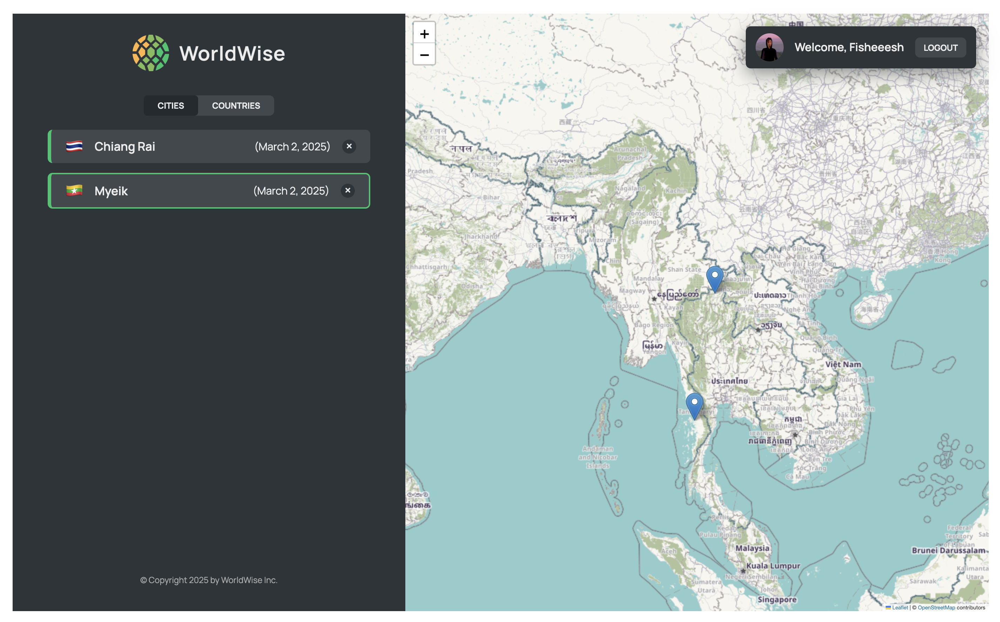

# 🌍 WorldWise

**WorldWise** is a mini app that helps users track places they’ve visited around the world. Built with **React-Leaflet**, it allows users to mark locations on a map, add personal notes or memories, and view them later.

## Features

- Click anywhere on the map to add a location with notes.
- Save locations with markers for future reference.
- Use the **"Current Location"** button to mark where you are.
- Data is stored in **localStorage** to work seamlessly on **Vercel**.
- Built with **useReducer + Context API** for state management.
- Initially implemented with **JSON-Server**, but switched to **localStorage** for live deployment.

## Tech Stack

- **React**
- **React-Leaflet** (for interactive maps)
- **React-Router** (for navigation)
- **useReducer + Context API** (for state management)
- **LocalStorage** (for data persistence)

## Note

This app is for **practice only** and does not include authentication.  
All users share the same data as a single account.

## 🔗 Live Demo

Play around it here - https://worldwise-pearl-ten.vercel.app
